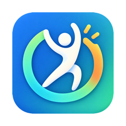
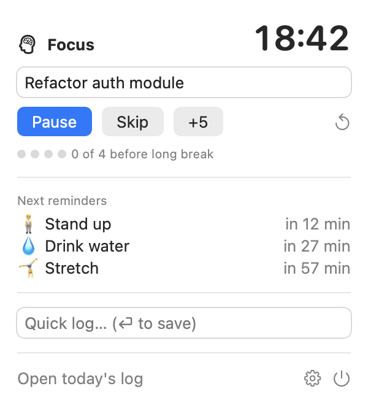
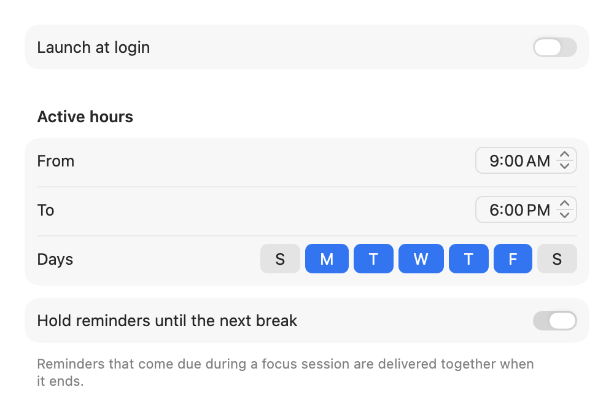
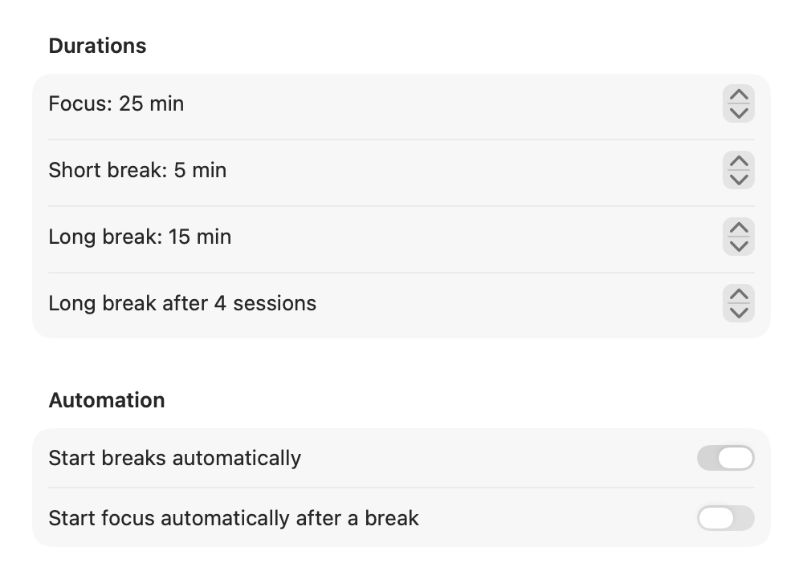
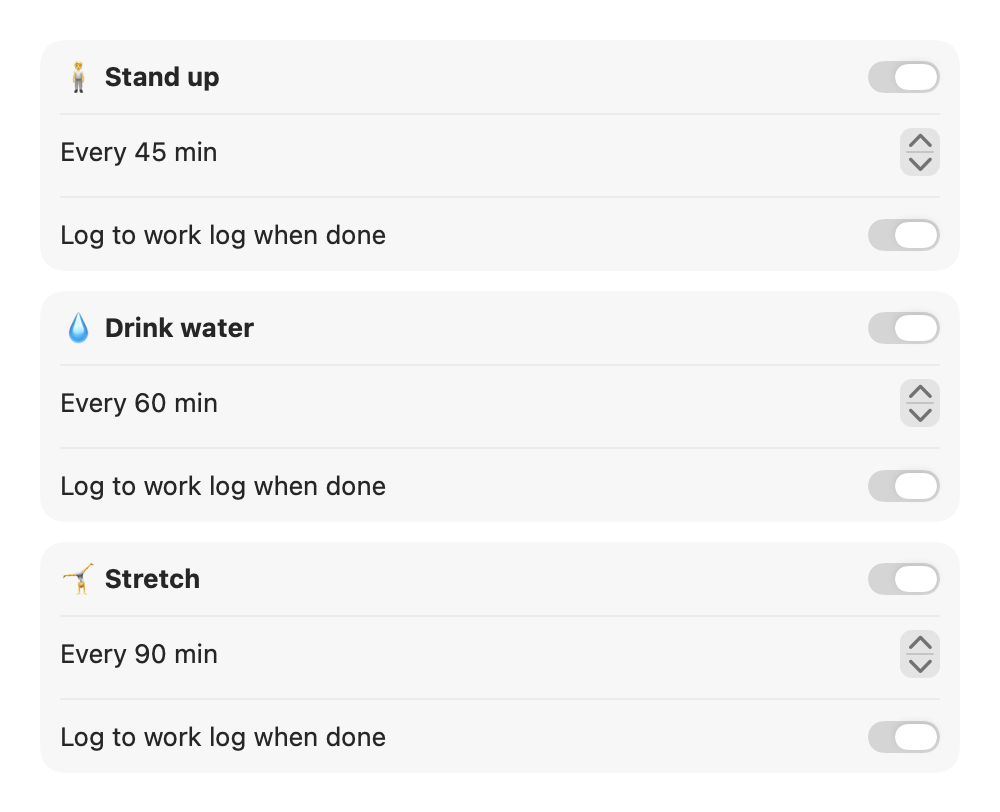
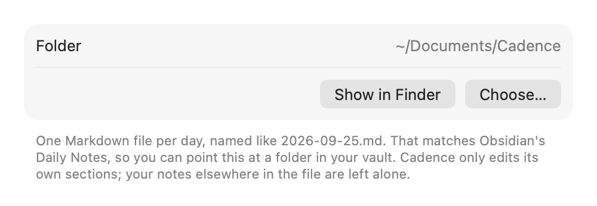

<p align="center">
  
</p>

<h1 align="center">Cadence</h1>

<p align="center">
  A native macOS menu bar app for focused work, healthy breaks and a daily work log in plain Markdown.
</p>

<p align="center">
  
  
  
</p>

---

Cadence runs in the menu bar only (no Dock icon). It does three things:

1. **Focus**: a Pomodoro timer that tracks what you're working on.
2. **Reminders**: nudges to stand up, drink water and stretch. Reminders that come due
   during a focus session wait until your break.
3. **Work log**: everything you do lands in a daily Markdown file, in a folder you choose.
   The files work with any editor and with Obsidian.

## Screenshots

<p align="center">
  
</p>
<p align="center"><em>The menu bar popover during a focus session</em></p>

| General | Pomodoro |
|---|---|
|  |  |
| **Reminders** | **Work Log** |
|  |  |

> The screenshots are rendered from the real SwiftUI views with demo data (`make screenshots`).
> In these renders, switches that are on appear grey rather than blue.

## Features (v0.1)

### Pomodoro timer
- Focus, short break and long break lengths you can configure, plus how many sessions
  come before a long break.
- A live countdown in the menu bar while the timer runs.
- Type what you're working on before or during a session. When the session ends, Cadence
  asks *"What did you get done?"*. You can answer in the popover, or type straight into
  the notification.
- Pause, resume, skip, add 5 minutes, or reset the cycle.
- Breaks can start automatically, and so can the next focus session after a break.
- Focus pauses when your Mac goes to sleep. The timer counts down to a stored end time,
  so it stays accurate.

### Reminders
- **🧍 Stand up** every 45 min, **💧 Drink water** every 60 min, **🤸 Stretch** every
  90 min. You can change each interval or turn each reminder off.
- **Active hours and days**: reminders only fire during your working hours (default:
  Mon–Fri, 9:00–18:00).
- **Held during focus**: reminders that come due mid-session are delivered together in the
  notification that ends the session. You can turn this off.
- Notification actions: **Done** (counted and optionally logged) and **Snooze 10 min**.
- Interval timers restart when your Mac wakes from sleep.

### Work log
- **Quick log** field in the popover: type, press ⏎, and it's saved with a timestamp.
- Finished focus sessions and completed reminders are logged automatically.
- One Markdown file per day (`yyyy-MM-dd.md`) in a folder you pick.
- A **Summary** table (focus time, Pomodoros, reminders completed) is kept up to date.
- Your own edits are safe (see [Work log format](#work-log-format)).

### General
- Launch at login.
- Unsandboxed, so the log folder can be anywhere: `~/Documents`, iCloud Drive, Dropbox,
  or an Obsidian vault.

## Installation

### Homebrew

```sh
brew install --cask hoshi-corp/cadence/cadence
```

Upgrade with `brew upgrade --cask cadence`. If a release isn't notarized, the cask clears the
quarantine flag so Gatekeeper doesn't block the app.

### From source

#### Requirements

- macOS 14 Sonoma or later
- Xcode, with Xcode selected as the active developer directory and its license accepted:
  ```sh
  sudo xcode-select -s /Applications/Xcode.app/Contents/Developer
  sudo xcodebuild -license accept
  ```
- [XcodeGen](https://github.com/yonaskolb/XcodeGen):
  ```sh
  brew install xcodegen
  ```

#### Build and install

```sh
git clone https://github.com/Hoshi-Corp/cadence.git
cd cadence
make install
```

This builds a Release version, copies it to `/Applications/Cadence.app` and launches it.
A timer icon appears in the menu bar. On first launch, macOS asks whether Cadence can send
notifications. Allow it, otherwise reminders and the end-of-session prompt won't appear.

To update later, run `git pull && make install`.

### Using it on more than one Mac

Every Mac has its own settings, so you can point your work Mac and your personal Mac at
different log folders. If both Macs write into the **same** synced folder, they will write
to the same daily file and your sync service may create conflicted copies. Use separate
folders for now. A per-machine filename option is on the [roadmap](#roadmap).

## Usage

1. Click the menu bar icon, type what you're working on, and press **Start**.
2. When the session ends, you get a notification with any reminders that were held.
   Describe what you got done in the notification or in the popover.
3. During breaks, act on the reminders and click **Done** so they're counted.
4. Anytime: type in **Quick log** to record meetings, decisions or anything else.
5. Click **Open today's log** to open the file in your default Markdown app.

Settings (⚙ in the popover) has four tabs: **General** (launch at login, active hours,
holding reminders during focus), **Pomodoro**, **Reminders** and **Work Log** (folder).

## Work log format

Files are named `yyyy-MM-dd.md`, the same format as Obsidian's **Daily Notes** plugin. If
your log folder is your Obsidian daily notes folder, Cadence writes into the same notes you
open in Obsidian.

A day's file looks like this:

```markdown
# Work Log — Thursday, September 25, 2026

<!-- cadence:timeline:start -->
## Timeline

- **09:05–09:30** 🍅 Refactor auth module — *extracted token service*
- **09:30** 💧 Drink water
- **10:15** Standup with team #meeting
- **11:00–11:25** 🍅 Review PR #412
<!-- cadence:timeline:end -->

<!-- cadence:summary:start -->
## Summary

| Metric | Value |
|---|---|
| Focus time | 50m |
| Pomodoros | 2 |
| 💧 Drink water | 1 |
<!-- cadence:summary:end -->

## My notes
Anything outside the markers belongs to you.
```

How Cadence writes to the file:

- The `<!-- cadence:… -->` markers are HTML comments. They don't show when the Markdown is
  rendered, including in Obsidian's reading view.
- **Timeline** entries are only ever *appended*. You can edit existing lines freely.
  If you edit a focus session's line before its outcome arrives, the outcome is added as
  a separate `↳` line instead.
- **Summary** is rewritten on every update from Cadence's own counters.
- Text **outside** the markers is never touched. If today's file already exists (for
  example, an Obsidian daily note), Cadence adds its sections to the end.
- The file is re-read before every write and saved atomically, so edits made in another
  app aren't lost.
- `#tags` typed in entries are plain text in most editors and tags in Obsidian.

## Where data lives

| What | Where |
|---|---|
| Daily work logs | The folder chosen in Settings → Work Log (default `~/Documents/Cadence`) |
| Summary counters | `~/Library/Application Support/Cadence/stats/yyyy-MM-dd.json` |
| Preferences | `UserDefaults` domain `com.masaruhoshi.cadence` |

Cadence makes no network requests. Your data stays on your Mac and in whatever folder you
point it at.

## Roadmap

| Version | Status | Scope |
|---|---|---|
| **v0.1** | ✅ Released | Menu bar app, Pomodoro timer, three wellness reminders held during focus, quick log, daily Markdown file with marker-based sections, folder picker, launch at login |
| **v0.2** | ⏳ Next | Custom reminders (interval, fixed time, one-off), global hotkey for quick log, **Today** view to edit and delete entries, idle detection (resets reminders after you've been away), export and import of settings |
| **v0.3** | Planned | Automatic activity tracking, level 1 (frontmost app, no permission needed), merging of activity into segments, **Activity Review** window to rename, merge, split or exclude segments, rules that map apps or window titles to tasks |
| **v0.4** | Planned | Activity tracking levels 2–3 (window titles via Accessibility, browser tabs via Automation), private segments, ignore list |
| **v0.5** | Planned | Obsidian options (YAML front matter / Properties, `[[project]]` links, "Open in Obsidian"), end-of-day summary prompt, machine name in filenames for shared folders |
| **v1.0** | Planned | Polish, onboarding, sounds, optional Developer ID signing and a notarized DMG, auto-update |
| Later | Ideas | Weekly and monthly roll-ups, Shortcuts / AppleScript actions, calendar-aware reminders (held during meetings), focus modes during Pomodoros |

### Activity tracking levels (v0.3+)

| Level | Captures | Permission |
|---|---|---|
| 1 | Frontmost app and time spent | None |
| 2 | Window titles | Accessibility |
| 3 | Browser tab title and URL | Automation (per browser) |

Every level is opt-in. You can edit any recorded activity before it's written to the log.

## Development

```sh
make test         # run unit tests (Swift Testing)
make build        # Release build into build/
make run          # build and launch from build/
make install      # build, copy to /Applications, launch
make open         # generate and open the Xcode project
make screenshots  # re-render docs/screenshots from the real views
make icons        # rebuild the app icon set from Resources/AppIcon-source.png
make clean        # remove build/ and the generated project
```

The Xcode project is **generated** from [`project.yml`](project.yml) by XcodeGen and isn't
committed. Edit `project.yml`, not the `.xcodeproj`. The Makefile uses
`/Applications/Xcode.app` through `DEVELOPER_DIR`.

When you run `make test`, Xcode prints warnings such as `CoreSimulator is out of date` and
`DVTCoreDeviceCore … Symbol not found`. They come from Xcode's iOS device and simulator
plugins and don't affect this Mac-only project.

### Project layout

```
Cadence/
  App/          entry point; AppState connects all the parts
  Pomodoro/     PomodoroEngine state machine
  Reminders/    Reminder model; ReminderScheduler (holds reminders during focus)
  WorkLog/      Markdown document operations, entries, daily stats, file store
  Preferences/  Codable preferences saved to UserDefaults
  System/       notifications, launch at login
  UI/           menu bar popover and Settings window
  Assets.xcassets/  app icon (generated by `make icons`)
CadenceTests/   unit tests and the screenshot renderer
Config/         signing configuration
Resources/      source artwork
scripts/        icon generator
docs/           README images
```

### Signing

Builds are **ad-hoc signed** by default, which needs no Apple account. That's enough while
Cadence only asks for notification permission.

Activity tracking (v0.3) needs the Accessibility permission, and macOS ties that
permission to the code signature. With ad-hoc signing you would have to grant it again
after every rebuild. To avoid that, set up a stable identity on each Mac:

1. Xcode → Settings → Accounts → add your Apple ID (a free account works). Xcode creates
   an *Apple Development* certificate.
2. Create `Config/Signing.local.xcconfig`. It's git-ignored because it differs per Mac:

   ```
   CADENCE_SIGN_IDENTITY = Apple Development
   CADENCE_TEAM = <your team ID, shown in Xcode's Accounts pane>
   CODE_SIGN_STYLE = Automatic
   ```
