<p align="center">
  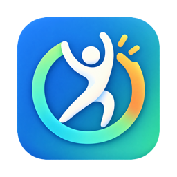
</p>

<h1 align="center">Cadence</h1>

<p align="center">
  A native macOS menu bar app for focused work, healthy breaks and a daily work log in plain Markdown.
</p>

<p align="center">
  
  
  
</p>

---

Cadence runs in the menu bar only (no Dock icon). It does four things:

1. **Focus**: a Pomodoro timer that tracks what you're working on.
2. **Reminders**: nudges to stand up, drink water and stretch, plus any of your own, at an
   interval, a set time or once. Reminders that come due during a focus session wait until
   your break.
3. **Work log**: everything you do lands in a daily Markdown file, in a folder you choose.
   The files work with any editor and with Obsidian.
4. **Activity**: optionally records which app is in front, groups it into segments you
   can review and rename, and writes the day's activity to the same file.

## Screenshots

<p align="center">
  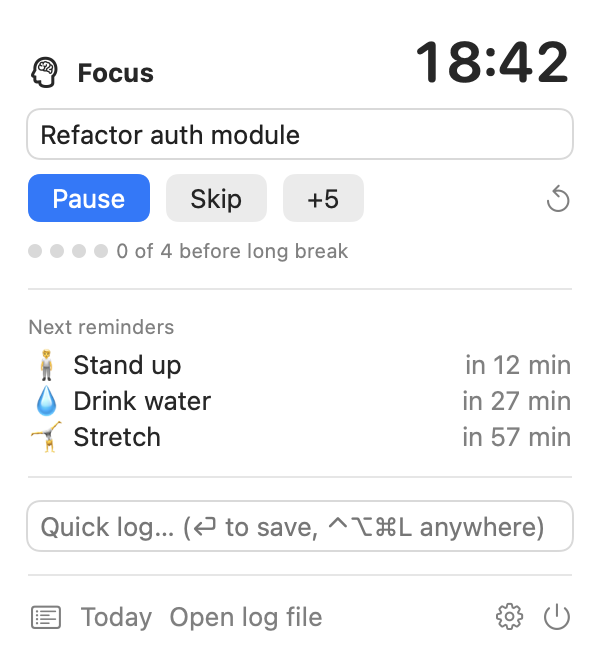
</p>
<p align="center"><em>The menu bar popover during a focus session</em></p>

| General | Pomodoro |
|---|---|
| 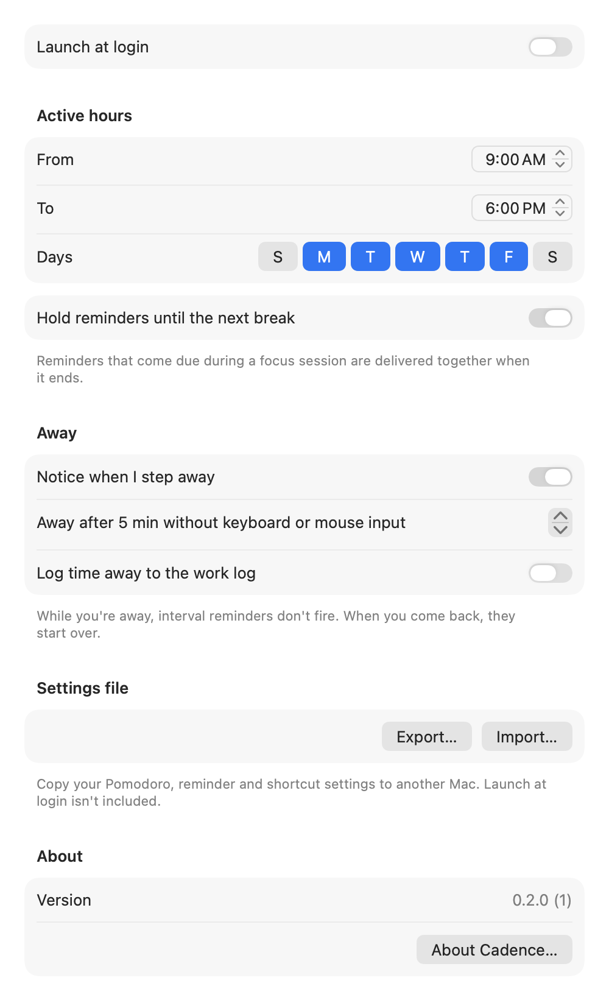 | 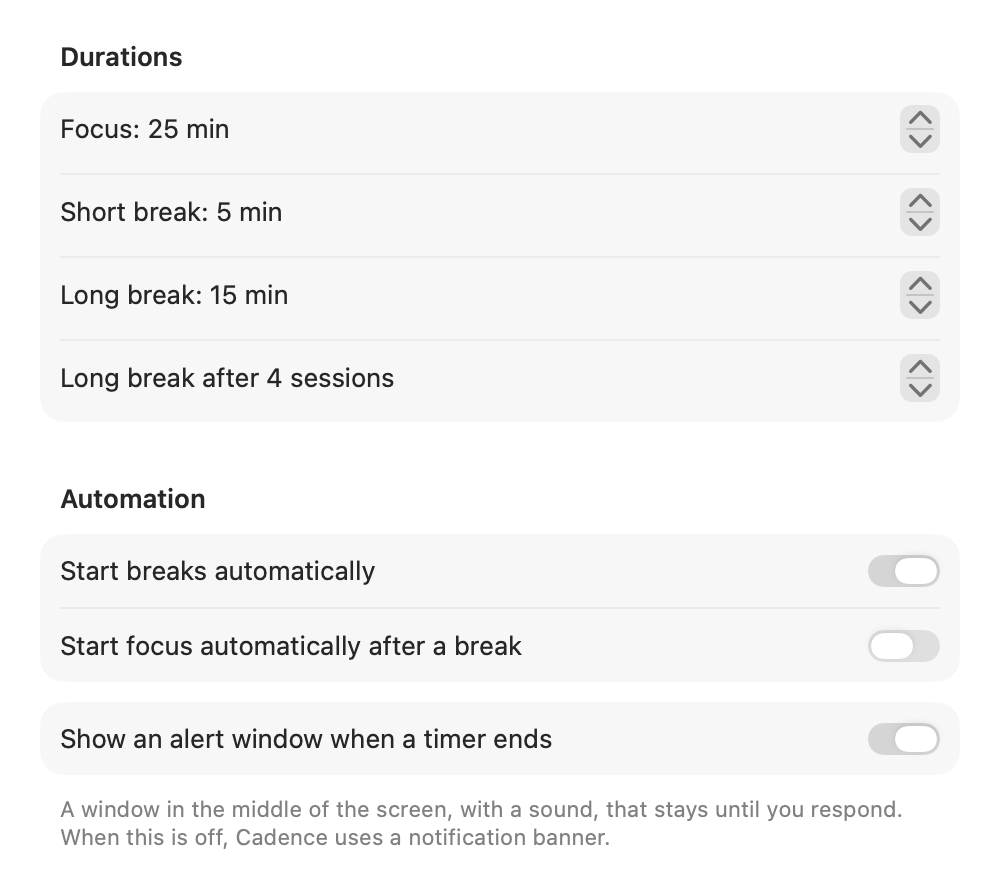 |
| **Reminders** | **Work Log** |
| 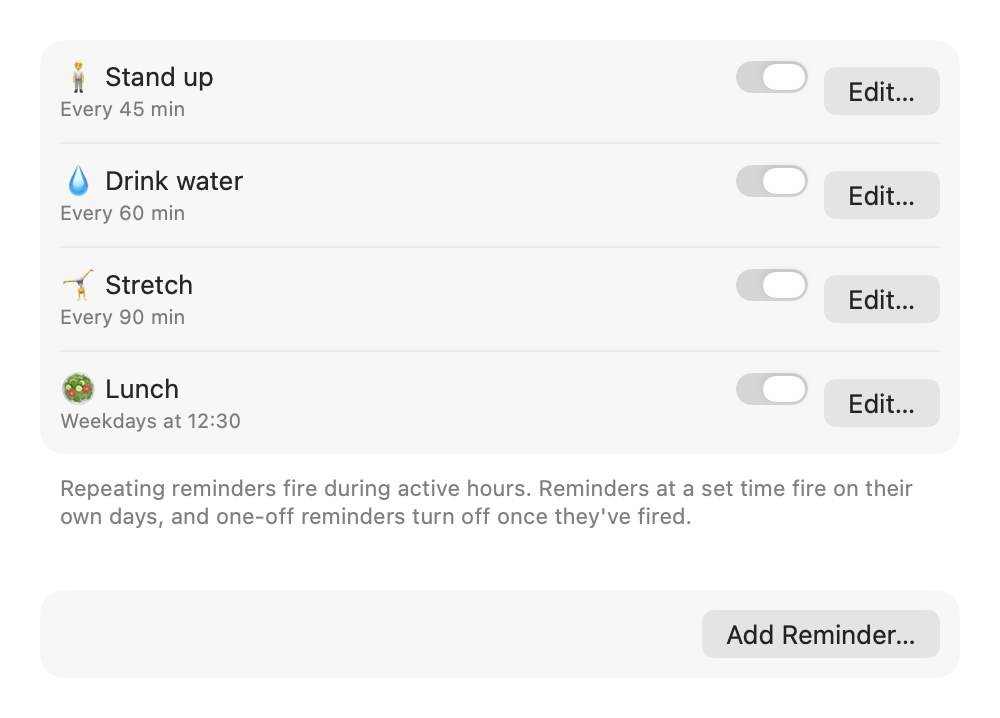 | 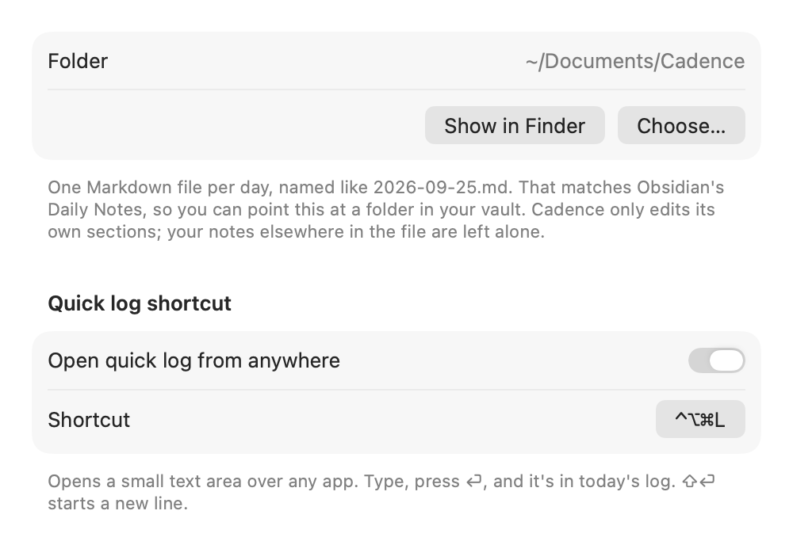 |
| **Activity** | |
| 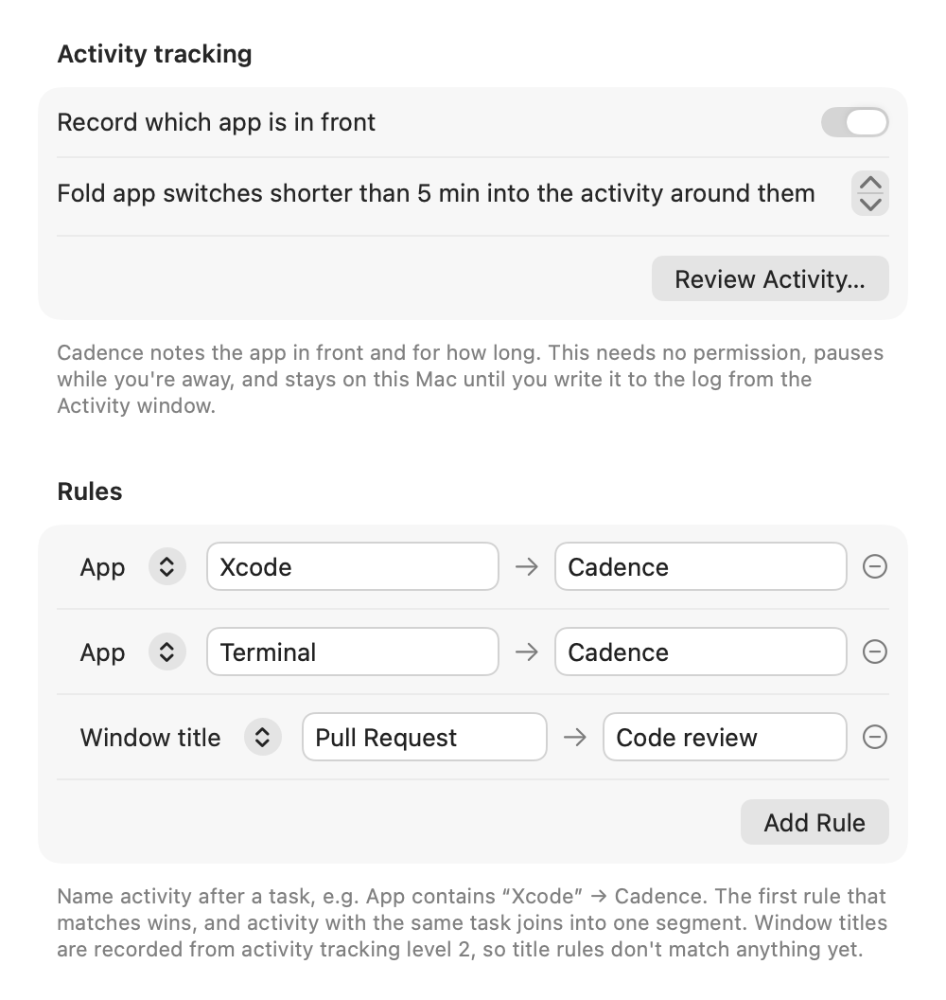 | |

<p align="center">
  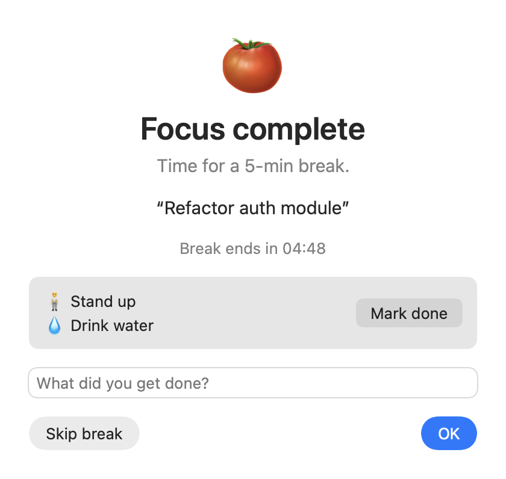
</p>
<p align="center"><em>The alert when a focus session ends</em></p>

<p align="center">
  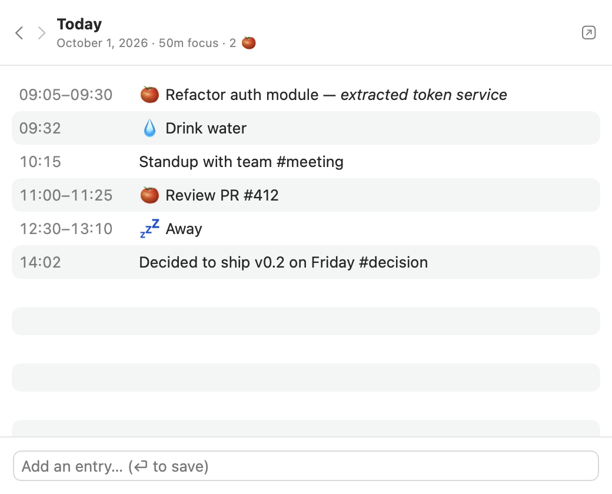
</p>
<p align="center"><em>The Today window: fix or delete entries without opening the file</em></p>

<p align="center">
  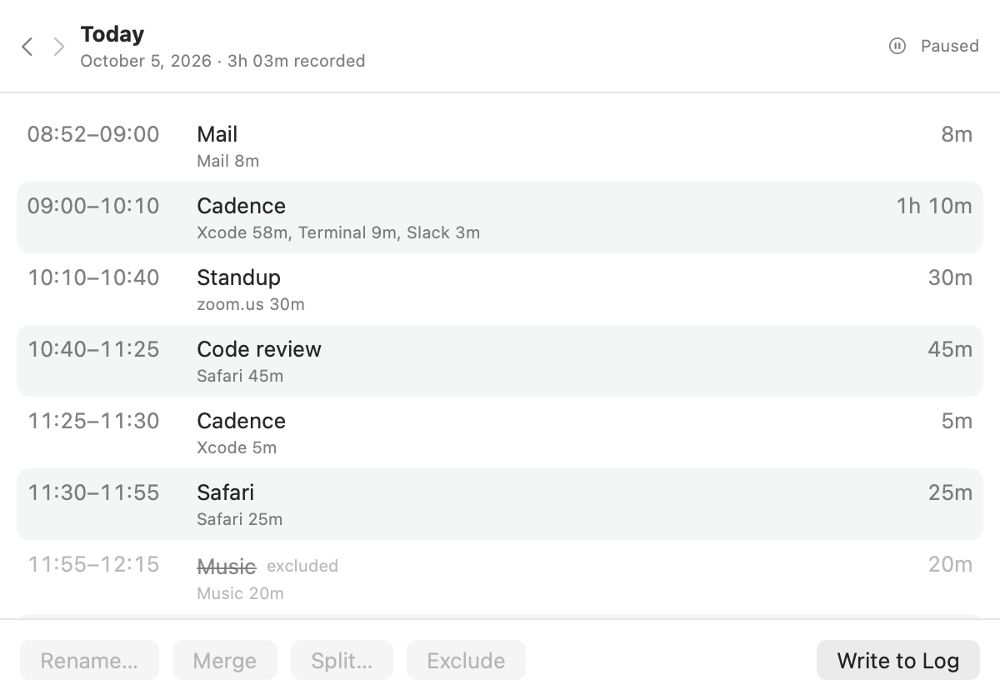
</p>
<p align="center"><em>The Activity window: rename, merge, split or exclude segments, then write them to the log</em></p>

<p align="center">
  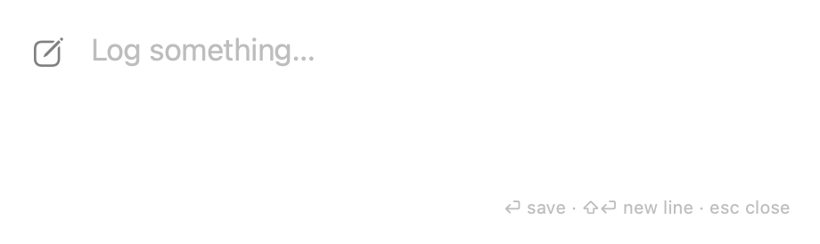
</p>
<p align="center"><em>The quick log panel, opened with ⌃⌥⌘L from any app. ⇧⏎ starts a new line.</em></p>

> The screenshots are rendered from the real SwiftUI views with demo data (`make screenshots`).
> In these renders, switches that are on appear grey rather than blue.

## Features

### Pomodoro timer
- Focus, short break and long break lengths you can configure, plus how many sessions
  come before a long break.
- A live countdown in the menu bar while the timer runs.
- **Timer alert**: when a focus session or break ends, a window appears in the middle of
  the screen with a sound, and stays until you respond. From it you can start or skip the
  break, mark held reminders done and log what you got done. It doesn't take keyboard
  focus, so typing in another app can't press its buttons; click it to type. You can switch
  back to notification banners in Settings → Pomodoro.
- Type what you're working on before or during a session. When the session ends, Cadence
  asks *"What did you get done?"*. You can answer in the popover, or type straight into
  the notification.
- Pause, resume, skip, add 5 minutes, or reset the cycle.
- Breaks can start automatically, and so can the next focus session after a break.
- Focus pauses when your Mac goes to sleep. The timer counts down to a stored end time,
  so it stays accurate.

### Reminders
- **🧍 Stand up** every 45 min, **💧 Drink water** every 60 min, **🤸 Stretch** every
  90 min. You can edit each one or turn it off.
- **Custom reminders** with a name, emoji and message, on one of three schedules:
  - **Repeat every few minutes**, during active hours.
  - **At a set time** on the days you choose, e.g. *🥗 Lunch, weekdays at 12:30*.
  - **Once**, at a date and time. It turns itself off after it fires.
- **Active hours and days**: repeating reminders only fire during your working hours
  (default: Mon–Fri, 9:00–18:00). Set-time and one-off reminders fire at their time.
- **Held during focus**: reminders that come due mid-session are delivered together in the
  notification that ends the session. You can turn this off.
- Notification actions: **Done** (counted and optionally logged) and **Snooze 10 min**.
- Repeating reminders start over when your Mac wakes from sleep. A set-time reminder
  missed while the Mac slept is shown on wake if it's still the same day.

### Away detection
- After 5 minutes (configurable) without keyboard or mouse input, Cadence treats you as
  away. Repeating reminders don't fire while you're away, and start over when you're back,
  since you've already had your break.
- Optionally logs the time away, e.g. `- **12:30–13:10** 💤 Away`.
- Uses the system idle time, so no permission is needed.

### Activity tracking
- **Off until you turn it on** (Settings → Activity). Level 1 records which app is in
  front and for how long. It needs no permission.
- Recording pauses while you're away, while the Mac sleeps and while another user's
  session is in front. Switching to Cadence itself isn't recorded.
- **Segments**: time is grouped into segments by app. Switches shorter than 5 minutes
  (configurable) are folded into the activity around them, so a quick look at Slack
  doesn't break up an hour in Xcode.
- **Rules** name activity after a task, e.g. *App contains "Xcode" → Cadence*. Activity
  with the same task joins into one segment, even across apps. Rules can also match window
  titles, which are recorded from level 2 (see the [roadmap](#roadmap)).
- **Activity window**: review a day's segments, then **rename**, **merge** neighbours,
  **split** one at a time, or **exclude** it from the log. Right-click a segment to add a
  rule for its app.
- **Write to Log** puts the reviewed segments in an **Activity** section of the day's
  file. Nothing is written until you click it, and writing again replaces the section.

### Work log
- **Quick log** text area in the popover: type, press ⏎, and it's saved with a timestamp.
  Press ⇧⏎ (or ⌥⏎) for a new line. A multi-line entry stays one list item, with the
  extra lines indented below it, so you can write a short list under a heading line.
- **Global shortcut** (default ⌃⌥⌘L, configurable): opens a small quick log text area
  over any app, without switching away from it. No permission needed.
- **Today** window: browse the day's entries (and earlier days), edit an entry's time or
  text, or delete it. The Summary counters follow, so deleting a 🍅 line removes that
  Pomodoro from the day's focus time.
- Finished focus sessions and completed reminders are logged automatically.
- One Markdown file per day (`yyyy-MM-dd.md`) in a folder you pick.
- A **Summary** table (focus time, Pomodoros, reminders completed) is kept up to date.
- Your own edits are safe (see [Work log format](#work-log-format)).

### General
- Launch at login.
- **Export and import settings** as a JSON file to set up another Mac the same way.
  Importing keeps this Mac's log folder unless you choose to take the one in the file.
- Unsandboxed, so the log folder can be anywhere: `~/Documents`, iCloud Drive, Dropbox,
  or an Obsidian vault.

## Installation

### Homebrew

```sh
brew install --cask hoshi-corp/cadence/cadence
```

Upgrade with `brew upgrade --cask cadence`. If a release isn't notarized, the cask clears the
quarantine flag so Gatekeeper doesn't block the app.

### From source

#### Requirements

- macOS 14 Sonoma or later
- Xcode, with Xcode selected as the active developer directory and its license accepted:
  ```sh
  sudo xcode-select -s /Applications/Xcode.app/Contents/Developer
  sudo xcodebuild -license accept
  ```
- [XcodeGen](https://github.com/yonaskolb/XcodeGen):
  ```sh
  brew install xcodegen
  ```

#### Build and install

```sh
git clone https://github.com/Hoshi-Corp/cadence.git
cd cadence
make install
```

This builds a Release version, copies it to `/Applications/Cadence.app` and launches it.
A timer icon appears in the menu bar. On first launch, macOS asks whether Cadence can send
notifications. Allow it, otherwise reminders and the end-of-session prompt won't appear.

To update later, run `git pull && make install`.

### Using it on more than one Mac

Every Mac has its own settings, so you can point your work Mac and your personal Mac at
different log folders. If both Macs write into the **same** synced folder, they will write
to the same daily file and your sync service may create conflicted copies. Use separate
folders for now. To give both Macs the same reminders and timer settings, use
**Settings → General → Export…** on one and **Import…** on the other. A per-machine filename option is on the [roadmap](#roadmap).

## Usage

1. Click the menu bar icon, type what you're working on, and press **Start**.
2. When the session ends, an alert appears in the middle of the screen with any reminders
   that were held. Describe what you got done there or in the popover.
3. During breaks, act on the reminders and click **Done** so they're counted.
4. Anytime: type in **Quick log**, or press **⌃⌥⌘L** in any app, to record meetings,
   decisions or anything else.
5. Click **Today** to review the day's entries and fix or delete any of them, or the
   document icon to open the Markdown file in your default editor.
6. If activity tracking is on, click **Activity** at the end of the day, tidy up the
   segments, and click **Write to Log**.

Settings (⚙ in the popover) has five tabs: **General** (launch at login, active hours,
holding reminders during focus, away detection, settings export and import),
**Pomodoro**, **Reminders** (edit, add and delete reminders), **Work Log** (folder,
quick log shortcut) and **Activity** (tracking, short-switch folding, rules).

## Work log format

Files are named `yyyy-MM-dd.md`, the same format as Obsidian's **Daily Notes** plugin. If
your log folder is your Obsidian daily notes folder, Cadence writes into the same notes you
open in Obsidian.

A day's file looks like this:

```markdown
# Work Log — Thursday, September 25, 2026

<!-- cadence:timeline:start -->
## Timeline

- **09:05–09:30** 🍅 Refactor auth module — *extracted token service*
- **09:30** 💧 Drink water
- **10:15** Standup with team #meeting
  - auth module ships Friday
  - PR #412 needs a second reviewer
- **11:00–11:25** 🍅 Review PR #412
<!-- cadence:timeline:end -->

<!-- cadence:summary:start -->
## Summary

| Metric | Value |
|---|---|
| Focus time | 50m |
| Pomodoros | 2 |
| 💧 Drink water | 1 |
<!-- cadence:summary:end -->

<!-- cadence:activity:start -->
## Activity

- **09:00–10:10** Cadence · Xcode 58m, Terminal 9m, Slack 3m
- **10:10–10:40** Standup · Zoom 30m
- **10:40–11:30** Code review · Safari 45m, Xcode 5m
<!-- cadence:activity:end -->

## My notes
Anything outside the markers belongs to you.
```

How Cadence writes to the file:

- The `<!-- cadence:… -->` markers are HTML comments. They don't show when the Markdown is
  rendered, including in Obsidian's reading view.
- **Timeline** entries are only ever *appended*, except when you edit or delete one in
  the Today window. You can edit existing lines freely in any editor.
  If you edit a focus session's line before its outcome arrives, the outcome is added as
  a separate `↳` line instead.
- **Summary** is rewritten on every update from Cadence's own counters.
- **Activity** is only written when you click **Write to Log** in the Activity window,
  and is replaced as a whole each time.
- A multi-line quick log entry continues on lines indented by two spaces, so it stays one
  list item. Indented lines you add under an entry by hand count as part of it too.
- Text **outside** the markers is never touched. If today's file already exists (for
  example, an Obsidian daily note), Cadence adds its sections to the end.
- The file is re-read before every write and saved atomically, so edits made in another
  app aren't lost.
- `#tags` typed in entries are plain text in most editors and tags in Obsidian.

## Where data lives

| What | Where |
|---|---|
| Daily work logs | The folder chosen in Settings → Work Log (default `~/Documents/Cadence`) |
| Summary counters | `~/Library/Application Support/Cadence/stats/yyyy-MM-dd.json` |
| Recorded activity (before and after review) | `~/Library/Application Support/Cadence/activity/yyyy-MM-dd.json` |
| Preferences | `UserDefaults` domain `com.masaruhoshi.cadence` (export with Settings → General → Export…) |

Cadence makes no network requests. Your data stays on your Mac and in whatever folder you
point it at.

## Roadmap

| Version | Status | Scope |
|---|---|---|
| **v0.1** | ✅ Released | Menu bar app, Pomodoro timer, three wellness reminders held during focus, quick log, daily Markdown file with marker-based sections, folder picker, launch at login |
| **v0.2** | ✅ Released | Custom reminders (interval, fixed time, one-off), global hotkey for quick log, **Today** view to edit and delete entries, idle detection (resets reminders after you've been away), export and import of settings |
| **v0.3** | ✅ Released | Automatic activity tracking, level 1 (frontmost app, no permission needed), merging of activity into segments, **Activity Review** window to rename, merge, split or exclude segments, rules that map apps or window titles to tasks |
| **v0.4** | ⏳ Next | Activity tracking levels 2–3 (window titles via Accessibility, browser tabs via Automation), private segments, ignore list |
| **v0.5** | Planned | Obsidian options (YAML front matter / Properties, `[[project]]` links, "Open in Obsidian"), end-of-day summary prompt, machine name in filenames for shared folders |
| **v1.0** | Planned | Polish, onboarding, sounds, optional Developer ID signing and a notarized DMG, auto-update |
| Later | Ideas | Weekly and monthly roll-ups, Shortcuts / AppleScript actions, calendar-aware reminders (held during meetings), focus modes during Pomodoros |

### Activity tracking levels (v0.3+)

| Level | Captures | Permission |
|---|---|---|
| 1 | Frontmost app and time spent | None |
| 2 | Window titles | Accessibility |
| 3 | Browser tab title and URL | Automation (per browser) |

Every level is opt-in. You can edit any recorded activity before it's written to the log.

## Development

```sh
make test         # run unit tests (Swift Testing)
make build        # Release build into build/
make run          # build and launch from build/
make install      # build, copy to /Applications, launch
make open         # generate and open the Xcode project
make screenshots  # re-render docs/screenshots from the real views
make icons        # rebuild the app icon set from Resources/AppIcon-source.png
make clean        # remove build/ and the generated project
```

The Xcode project is **generated** from [`project.yml`](project.yml) by XcodeGen and isn't
committed. Edit `project.yml`, not the `.xcodeproj`. The Makefile uses
`/Applications/Xcode.app` through `DEVELOPER_DIR`.

When you run `make test`, Xcode prints warnings such as `CoreSimulator is out of date` and
`DVTCoreDeviceCore … Symbol not found`. They come from Xcode's iOS device and simulator
plugins and don't affect this Mac-only project.

### Project layout

```
Cadence/
  App/          entry point; AppState connects all the parts
  Pomodoro/     PomodoroEngine state machine
  Reminders/    Reminder model and schedules; ReminderScheduler (holds reminders during focus)
  WorkLog/      Markdown document operations, entries, timeline items, daily stats, file store
  Preferences/  Codable preferences saved to UserDefaults; settings file export/import
  System/       notifications, launch at login, global hotkey, idle detection
  UI/           menu bar popover, quick log panel, Today window and Settings window
  Assets.xcassets/  app icon (generated by `make icons`)
CadenceTests/   unit tests and the screenshot renderer
Config/         signing configuration
Resources/      source artwork
scripts/        icon generator
docs/           README images
```

### Signing

Builds are **ad-hoc signed** by default, which needs no Apple account. That's enough while
Cadence only asks for notification permission, which is the case up to v0.3: activity
tracking level 1 needs no permission.

Window titles (activity tracking level 2, v0.4) need the Accessibility permission, and
macOS ties that permission to the code signature. With ad-hoc signing you would have to
grant it again after every rebuild. To avoid that, set up a stable identity on each Mac:

1. Xcode → Settings → Accounts → add your Apple ID (a free account works). Xcode creates
   an *Apple Development* certificate.
2. Create `Config/Signing.local.xcconfig`. It's git-ignored because it differs per Mac:

   ```
   CADENCE_SIGN_IDENTITY = Apple Development
   CADENCE_TEAM = <your team ID, shown in Xcode's Accounts pane>
   CODE_SIGN_STYLE = Automatic
   ```

   The team ID is the `OU` field of the certificate, not the ID in parentheses after your
   email. To read it:

   ```sh
   security find-certificate -c "Apple Development" -p | openssl x509 -noout -subject
   ```

If `security find-identity -v -p codesigning` reports `0 valid identities` and `codesign`
fails with `errSecInternalComponent`, the certificate's private key or Apple's
intermediate certificate is missing. Create the certificate from Xcode's Accounts pane so
the key is on this Mac, and install the current *Worldwide Developer Relations*
intermediate (G3) from <https://www.apple.com/certificateauthority/>.
